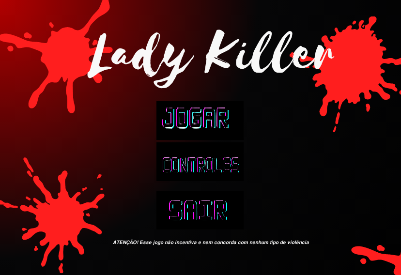
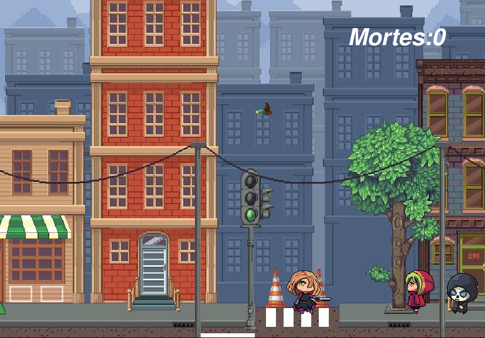
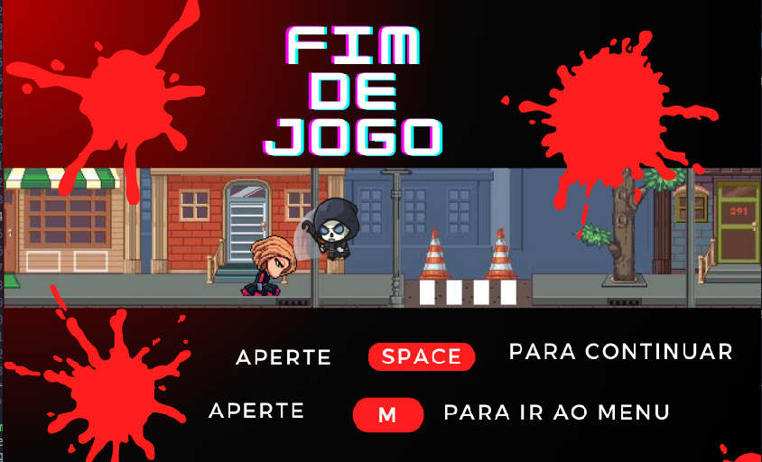

<h1 align='center'>Lady Killer</h1>
<p align='center'> 
 
</p>
<p align="center">
  
   
   
</p>

# Índice

- [Descrição do Projeto](#descrição-do-projeto)
- [Tecnologias utilizadas](#tecnologias-utilizadas)
- [Autor](#author)

# Descrição do Projeto

Lady Killer é um mini jogo que tem como tema principal o True Crime, sua personagem é uma serial killer que precisa matar o máximo de vítimas possiveis antes que a morte a pegue.

## Para rodar o jogo na sua maquina:

```
git clone https://github.com/lomaferreira/Lady_Killer.git
pip install -r requirements.txt
```

**Atenção:** _É necessário ter instalado o python_


# Tecnologias utilizadas

- Python
- Git e Github
- Pygame
- Canva

# Autor

<br><sub >Paloma Santos Ferreira </sub>
